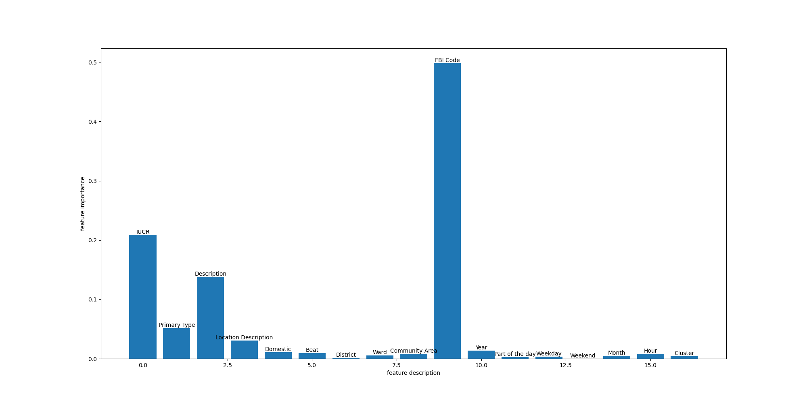

## Exécution du code

```
python3 main.py <fichier.csv>
```

Télécharger les fichiers ici :
* https://www.jeromecst.com/Crimes100KEq.csv
* https://www.jeromecst.com/Crimes1MEq.csv

## Carte de la densité des crimes à Chicago


## Répartition des crimes


## Importance des features



## Meilleurs paramètres pour le DecisionTree


## Meilleur nombre de clusters


## Meilleur nombre de données


## Matrice de confusion


## Pourcentage d'arrestation selon le type de crime


## Fréquence des crimes en fonction leur type


