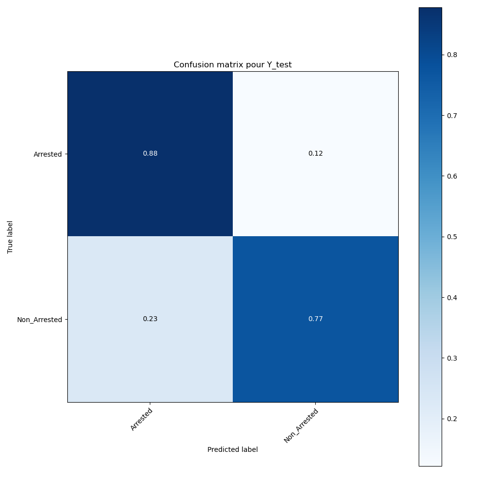
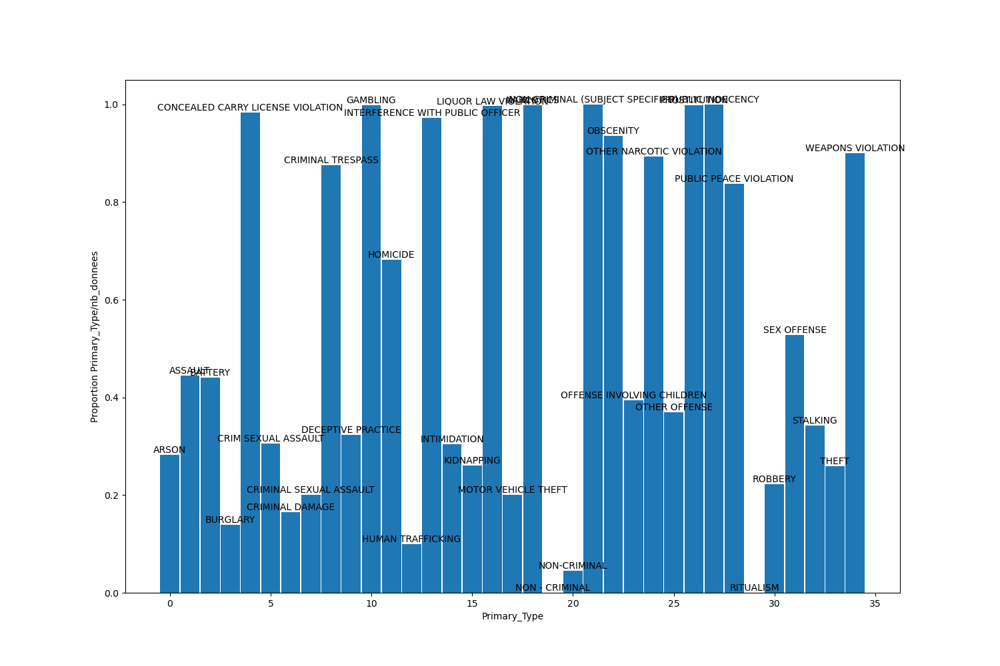
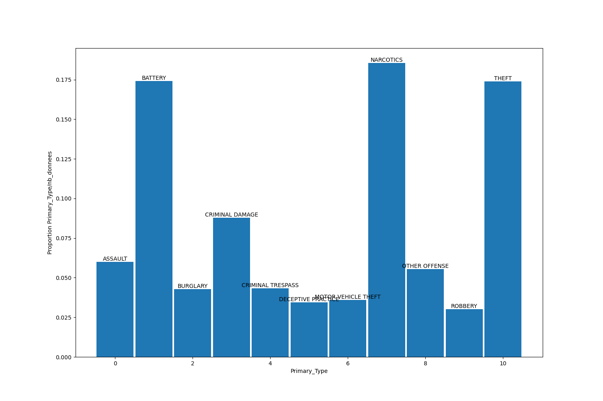

## Exécution du code

```
python3 main.py fichier.csv [reload]
```
* fichier.csv correspond au dataset au format csv
* reload est une option facultative pour regénérer le preprocessing (se fait automatiquement si le fichier preprocessé n'est pas trouvé)

Télécharger les fichiers ici :
* https://www.jeromecst.com/Crimes100KEq.csv
* https://www.jeromecst.com/Crimes1MEq.csv

## Carte de la densité des crimes à Chicago


## Répartition des crimes


## Importance des features


## Meilleurs paramètres pour le DecisionTree


## Meilleur nombre de clusters


## Meilleur nombre de données


## Matrice de confusion



## Pourcentage d'arrestation selon le type de crime



## Fréquence des crimes en fonction leur type


